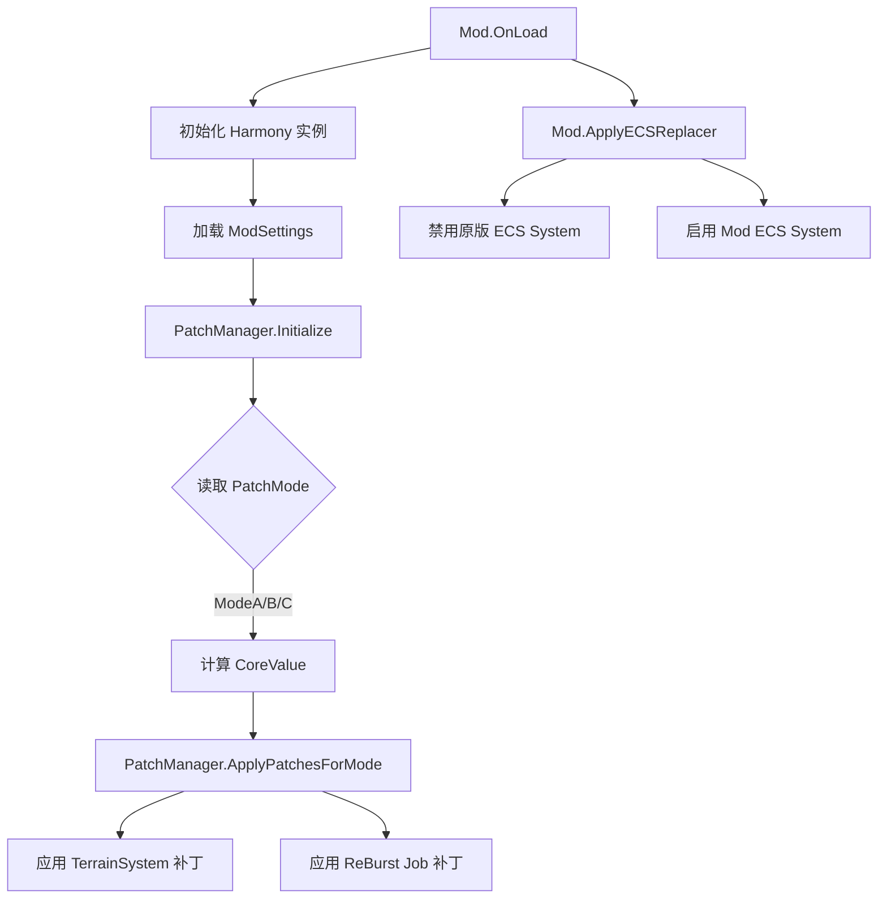
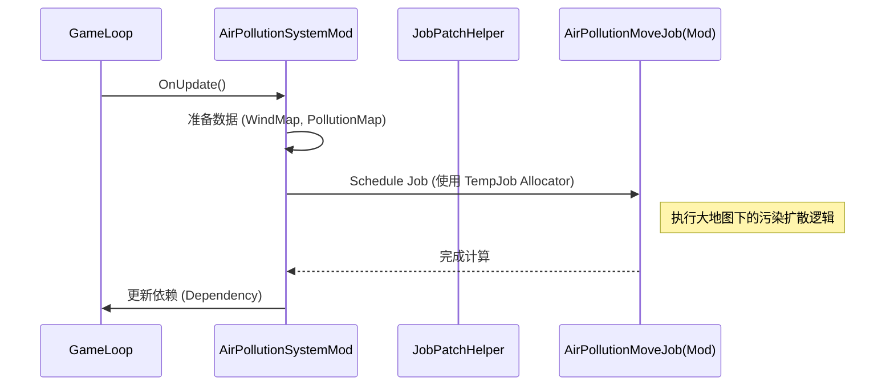

# MapExt2 核心逻辑总结文档

**版本号**: 2.2.0  
**生成日期**: 2026-01-31
**修订记录**:
- v1.0: 初始生成，基于源码系统性梳理。

---

## 1. 概述

MapExt2 是一个针对 *Cities: Skylines 2* 的地图扩展模组，旨在突破原版 14km (14336m) 的地图尺寸限制，支持 28km, 57km, 甚至 114km 的超大地图游玩。

本模组不仅仅是简单地修改地图边界，更核心的是对游戏底层的模拟系统（Simulation Systems）进行了深度的重构和替换（Re-Burst），以确保在扩大地图面积的同时，水流、污染、风力、地价等模拟机制依然能正确运行且保持精度。

## 2. 核心架构与模块划分

模组采用分层架构，主要分为以下几个核心模块：

### 2.1 核心引导模块 (Core Bootstrapper)

负责模组的生命周期管理、配置加载和补丁系统的初始化。

*   **关键类**: `Mod` (入口), `ModSettings` (配置), `PatchManager` (补丁管理)
*   **职责**:
    *   **初始化**: 在 `OnLoad` 中初始化日志、Harmony 实例。
    *   **双 Harmony 机制**:
        *   `_globalPatcher`: 用于全局通用的补丁（如存档验证、UI修复），并行加载。
        *   `_modePatcher`: 用于地图尺寸模式相关的补丁，支持运行时动态切换（Unpatch -> Patch）。
    *   **模式管理**: 根据用户设置 (`PatchModeSetting`) 决定启用哪种地图尺寸模式 (ModeA/B/C)，并计算核心倍率 `CurrentCoreValue`。

### 2.2 地形扩展模块 (Map Size Extender)

负责修改游戏底层的地形系统，使其识别并处理更大的坐标范围。

*   **关键类**: `TerrainSystemPatches`
*   **核心逻辑**:
    *   **边界修改**: 通过 Harmony Prefix 拦截 `TerrainSystem.FinalizeTerrainData`，将地图尺寸 (`inMapSize`) 乘以倍率。
    *   **硬编码替换**: 使用 Harmony Transpiler 扫描 `GetTerrainBounds` 和 `GetHeightData` 等方法的 IL 代码，将原版硬编码的 `14336f` 替换为动态计算的新尺寸。

### 2.3 模拟重构模块 (Simulation Re-Burst)

这是模组最复杂的部分，负责接管和修正所有基于网格（CellMap）的模拟系统。

*   **关键类**: `ReBurstCellSystem` 目录下的各类, `JobPatchHelper`, `CellMapSystemRe`
*   **实现策略**:
    1.  **ECS 系统替换 (System Replacement)**:
        *   直接禁用原版系统（如 `AirPollutionSystem`）。
        *   启用继承自 `CellMapSystem<T>` 的 Mod 自定义系统（如 `AirPollutionSystemMod`）。
        *   自定义系统在 `OnCreate` 时使用更大的纹理尺寸 (`kTextureSize`) 初始化，以保持模拟精度。
    2.  **Job 动态注入 (Job Injection)**:
        *   对于无法完全替换的系统，使用 `JobPatchHelper` 和 `GenericJobReplacePatch`。
        *   **原理**: 利用 Harmony Transpiler 在 IL 层面拦截原版系统对 Burst Job 的调度 (`Schedule`)，将其替换为 Mod 提供的兼容大地图的 Job (`ReBurstJob`)。
        *   **优势**: 无需复制整个系统代码，仅替换核心计算逻辑。
    3.  **坐标重定向 (Coordinate Redirection)**:
        *   `CellMapSystemRe` 提供了一组静态方法 (`GetCell`, `GetCellCenter`)，重写了坐标到网格索引的映射算法，确保在大地图坐标下能正确采样。

### 2.4 兼容性与修复模块

*   **存档验证**: `MetaDataExtenderPatch` 确保大地图存档能被正确识别和加载。
*   **经济系统修复**: 可选开启，修复大地图下的地价和需求计算问题。
*   **水系统重置**: `WaterSystemReinitializer` 强制重置水体纹理，防止切换模式时崩溃。

---

## 3. 核心业务流程

### 3.1 初始化流程

### 3.2 模拟循环 (Simulation Loop) - 以污染系统为例

---

## 4. 核心机制详解

### 4.1 动态 Job 替换 (Dynamic Job Replacement)

模组不依赖于静态的 DLL 替换，而是使用 `GenericJobReplacePatch` 进行运行时 IL 修改。
*   **扫描**: 遍历目标 System 的 `OnUpdate` 方法。
*   **识别**: 查找 `Initobj` 指令（初始化 Job 结构体）。
*   **替换**: 将原版 Job 类型替换为 Mod 提供的 Job 类型。
*   **字段映射**: 自动映射同名字段，支持类型不一致时的二进制重解释（Binary Reinterpretation）。

### 4.2 纹理重采样 (Texture Resampling)

原版游戏使用固定分辨率（如 256x256）覆盖 14km 地图。若直接扩大地图到 57km，网格精度会大幅下降（每个格子变得巨大）。
*   **解决方案**: `CellMapSystemRe` 定义了 `CellMapTextureSizeMultiplier`。
*   **实现**: 57km 模式下，纹理尺寸扩大 4 倍（如 1024x1024），保持单位面积内的网格密度与原版一致。

### 4.3 权限与配置

*   **配置存储**: 使用 `Colossal.IO.AssetDatabase` 存储设置。
*   **权限**: 需要访问文件系统以读写配置和日志。

---

## 5. 性能瓶颈与已知问题

### 5.1 性能瓶颈
*   **内存占用**: 大地图模式下，CellMap 纹理尺寸成倍增加（例如 16 倍像素量），显著增加显存和内存压力。
*   **Job 调度开销**: `Allocator.TempJob` 的频繁分配和释放可能带来轻微的 GC 或调度开销。
*   **模拟负载**: 模拟范围扩大意味着需要计算的实体（车辆、市民、水体）数量可能激增，导致 CPU 瓶颈。

### 5.2 扩展钩子 (Hooks)
*   **`JobPatchTarget`**: 开发者可以通过在 `JobPatchTarget.cs` 中注册新的条目，轻松替换其他 System 的 Job。
*   **`PatchManager`**: 支持添加新的 `PatchSet`，便于模块化扩展功能。

### 5.3 已知缺陷
*   **水体模拟**: 切换地图大小时，水体可能需要重新模拟，导致暂时的物理异常。
*   **边缘效应**: 在地图极边缘区域，部分硬编码的逻辑（如寻路启发式算法）可能仍会失效。

---

## 6. 附录：自动更新脚本

运行 `npm run doc:core` 可执行以下脚本，自动更新本文档的元数据（如文件结构树）。

*(脚本见项目根目录 `scripts/update-doc.js`)*

## 7. 代码统计
- **统计时间**: 2026/1/31 23:35:08
- **源文件目录**: `MapExt/`
- **C# 文件数**: 182
- **总行数**: 89384
