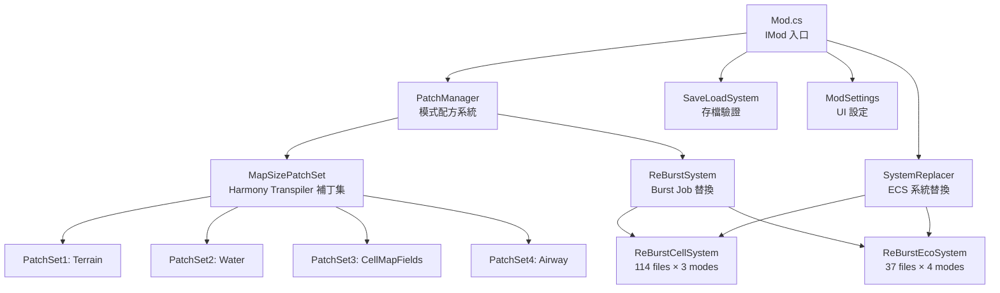
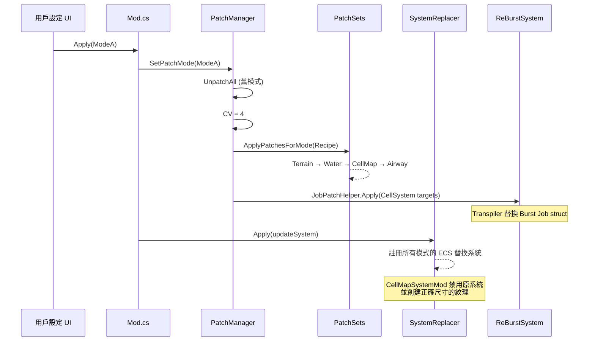

# MapExtPDX 項目架構摘要

> **MapExtPDX** — Cities: Skylines 2 大地圖 Mod，通過 ECS 系統替換 + Harmony IL Transpiler 實現多種地圖尺寸支援。

---

## 總覽

| 屬性 | 值 |
|---|---|
| **技術棧** | Unity DOTS/ECS, Burst (AOT), C# 9.0, Harmony 2.2.2 |
| **核心源文件** | ~170 個 `.cs` 文件 |
| **地圖模式** | 4 種：ModeA (57km, CV=4), ModeB (28km, CV=2), ModeC (114km, CV=8), None (Vanilla 14km, CV=1) |
| **分支** | `debug-optimization` |

---

## 架構總覽

---

## 核心子系統

### 1. 入口與生命週期 — [Mod.cs](file:///d:/CS2.WorkSpace/CS2Mod/A.Mod/MapExt2/MapExtPDX/MapExt/Mod.cs)

- **雙 Harmony 實例**：`_globalPatcher`（全局並行補丁，如存檔驗證）與 `_modePatcher`（模式專屬補丁，可卸載/切換）
- **啟動流程**：`OnLoad` → 初始化設定 → `PatchManager.Initialize` → 全局補丁 → `SystemReplacer.Apply`
- **模式切換**：設定 UI Apply → `OnPatchModeChanged` → `PatchManager.SetPatchMode`（先 UnpatchAll 再重新應用）

### 2. 模式配方系統 — [PatchManager.cs](file:///d:/CS2.WorkSpace/CS2Mod/A.Mod/MapExt2/MapExtPDX/MapExt/Core/PatchManager.cs)

- **核心概念**：`CoreValue (CV)` 為地圖尺寸倍率（原版 14336 × CV = 實際地圖邊長）
- **配方模式**：每種模式有一組「補丁集名稱」清單（Recipe），按序從註冊表中取出並執行
- **註冊表** `s_AllPatchSets`：字典映射 `string → Action<Harmony>`，包含 10 個補丁集

### 3. ECS 系統替換 — [SystemReplacer.cs](file:///d:/CS2.WorkSpace/CS2Mod/A.Mod/MapExt2/MapExtPDX/MapExt/Core/SystemReplacer.cs)

- 使用 `updateSystem.UpdateAt<T>()` 註冊所有模式專屬的替換系統
- 涵蓋 CellMapSystem 派生類（11+）和經濟系統（8+）

---

### 4. MapSizePatchSet — Harmony Transpiler 補丁集

| 補丁集 | 文件 | 功能 |
|---|---|---|
| **PatchSet1** | [PatchSet1Terrain.cs](file:///d:/CS2.WorkSpace/CS2Mod/A.Mod/MapExt2/MapExtPDX/MapExt/MapSizePatchSet/PatchSet1Terrain.cs), [PatchSet1TerrainR16.cs](file:///d:/CS2.WorkSpace/CS2Mod/A.Mod/MapExt2/MapExtPDX/MapExt/MapSizePatchSet/PatchSet1TerrainR16.cs) | 地形系統尺寸補丁 + R16 精度轉換 |
| **PatchSet2** | [PatchSet2Water.cs](file:///d:/CS2.WorkSpace/CS2Mod/A.Mod/MapExt2/MapExtPDX/MapExt/MapSizePatchSet/PatchSet2Water.cs) + 3 輔助文件 | 水系模擬系統尺寸補丁 + 初始化修復 |
| **PatchSet3** | [PatchSet3CellMapFields.cs](file:///d:/CS2.WorkSpace/CS2Mod/A.Mod/MapExt2/MapExtPDX/MapExt/MapSizePatchSet/PatchSet3CellMapFields.cs) | 全局掃描並替換所有 `kMapSize`/`kTextureSize` 的 `Ldsfld` → `Ldc_i4` |
| **PatchSet4** | [PatchSet4AirwaySystemPatch.cs](file:///d:/CS2.WorkSpace/CS2Mod/A.Mod/MapExt2/MapExtPDX/MapExt/MapSizePatchSet/PatchSet4AirwaySystemPatch.cs) | 航線系統尺寸補丁 |

---

### 5. ReBurstSystem — Burst AOT Job 替換系統

> [!IMPORTANT]
> 因 Burst AOT 會將 `kMapSize` 烘焙為常量，無法通過 Transpiler 修改，所以必須**整個替換系統**。

#### 5.1 Core 工具鏈

| 文件 | 功能 |
|---|---|
| [GenericJobReplacer.cs](file:///d:/CS2.WorkSpace/CS2Mod/A.Mod/MapExt2/MapExtPDX/MapExt/ReBurstSystem/Core/GenericJobReplacer.cs) | IL Transpiler 引擎：替換 Job struct 初始化（處理字段對齊、Bitcast 安全轉換） |
| [JobPatchHelper.cs](file:///d:/CS2.WorkSpace/CS2Mod/A.Mod/MapExt2/MapExtPDX/MapExt/ReBurstSystem/Core/JobPatchHelper.cs) | 批量應用替換目標的協調器 |
| [JobPatchDefinitions.cs](file:///d:/CS2.WorkSpace/CS2Mod/A.Mod/MapExt2/MapExtPDX/MapExt/ReBurstSystem/Core/JobPatchDefinitions.cs) | 靜態定義所有需替換的 Job 列表（按模式生成具體目標） |
| [XCellMapSystemRe.Template.cs](file:///d:/CS2.WorkSpace/CS2Mod/A.Mod/MapExt2/MapExtPDX/MapExt/ReBurstSystem/Core/XCellMapSystemRe.Template.cs) | 自動生成模式專屬 `CellMapSystemRe.cs` 的模板 |
| [GenerateXCellMapSystemRe.ps1](file:///d:/CS2.WorkSpace/CS2Mod/A.Mod/MapExt2/MapExtPDX/MapExt/ReBurstSystem/Core/GenerateXCellMapSystemRe.ps1) | PowerShell 構建腳本：從模板生成各模式的 `XCellMapSystemRe.cs` |

#### 5.2 ReBurstCellSystem（114 files × 3 modes）

按 **6 個子分類** 組織：

| 分類 | 含義 | 範例系統 |
|---|---|---|
| `ReBurstCellMapClosed` | System Replacement 的 `CellMapSystem<T>` 派生 | AirPollution, LandValue, NoisePollution 等 (12) |
| `ReBurstCellMapClosed2` | 需特殊處理的封閉系統 | TelecomCoverage, Wind (3) |
| `ReBurstCellMapRef` | 引用 CellMap 數據的系統 | Attraction, CarNavigation, ZoneSpawn (8) |
| `ReBurstCellMapRef2` | 間接引用 CellMap 的 UI/Trigger 系統 | PollutionInfoview, CitizenHappiness (4) |
| `ReBurstCellMapSub` | 子系統/Tooltip 類 | NetColor, PowerPlantAI, WaterPumping (4) |
| `ReBurstMapTile` | 地圖 Tile 操作系統 | AreaToolSystem, ValidationSystem (2+) |
| `ReBurstWaterRef` | 引用水系統的系統 | （水相關系統） |

每種模式（ModeA/B/C）完整複製一份上述結構。

#### 5.3 ReBurstEcoSystem（37 files × 4 modes）

每模式包含 8-9 個經濟系統替換：

| 編號 | 系統 | 功能 |
|---|---|---|
| A1-A3 | `DemandSystemRe` | 住宅/商業/工業需求 |
| B1-B2 | `FindJobSystemMod` | 市民/全局求職 |
| C1-C2 | `HouseholdFindProperty/BehaviorMod` | 家庭找房/行為 |
| D1 | `RentAdjustSystemRe` | 租金調整 |
| D2 | `LandValueSystemMod` | 地價系統（僅 vanilla 模式） |

每模式額外包含一個 `XCellMapSystemRe.cs`（由模板自動生成，提供該模式對應的 kMapSize 常量）。

---

### 6. SaveLoadSystem

| 文件 | 功能 |
|---|---|
| [GetSaveInfoPatch.cs](file:///d:/CS2.WorkSpace/CS2Mod/A.Mod/MapExt2/MapExtPDX/MapExt/SaveLoadSystem/GetSaveInfoPatch.cs) | 存檔元數據擴展（寫入 CV 值） |
| [LoadGameValidatorPatch.cs](file:///d:/CS2.WorkSpace/CS2Mod/A.Mod/MapExt2/MapExtPDX/MapExt/SaveLoadSystem/LoadGameValidatorPatch.cs) | 加載時驗證存檔模式與當前模式是否匹配 |
| [ModLocalization.cs](file:///d:/CS2.WorkSpace/CS2Mod/A.Mod/MapExt2/MapExtPDX/MapExt/SaveLoadSystem/ModLocalization.cs) | 彈窗本地化文本 |

### 7. Setting

| 文件 | 功能 |
|---|---|
| [ModSettings.cs](file:///d:/CS2.WorkSpace/CS2Mod/A.Mod/MapExt2/MapExtPDX/MapExt/Setting/ModSettings.cs) | 遊戲內設定 UI（模式選擇、功能開關） |
| [LocaleEN.cs](file:///d:/CS2.WorkSpace/CS2Mod/A.Mod/MapExt2/MapExtPDX/MapExt/Setting/LocaleEN.cs) / [LocaleHANS.cs](file:///d:/CS2.WorkSpace/CS2Mod/A.Mod/MapExt2/MapExtPDX/MapExt/Setting/LocaleHANS.cs) | 英文/簡中本地化 |

---

## 數據流

---

## 關鍵設計決策

1. **雙 Harmony 實例**：全局補丁不受模式切換影響，模式補丁可完整卸載重裝
2. **模式專屬 Burst 文件複製**：因 Burst AOT 烘焙常量，每種地圖尺寸需獨立編譯一份 Job
3. **Template + PowerShell 代碼生成**：`XCellMapSystemRe.Template.cs` 通過構建腳本自動生成各模式的 `kMapSize` 常量文件
4. **Texture 尺寸上限保護**：114km 模式下 texture 倍率鎖定為 1，防止超出 Unity 紋理限制
5. **序列化自適應**：所有替換系統使用 `TempJob` 分配器 + 尺寸匹配邏輯，兼容不同模式的存檔
